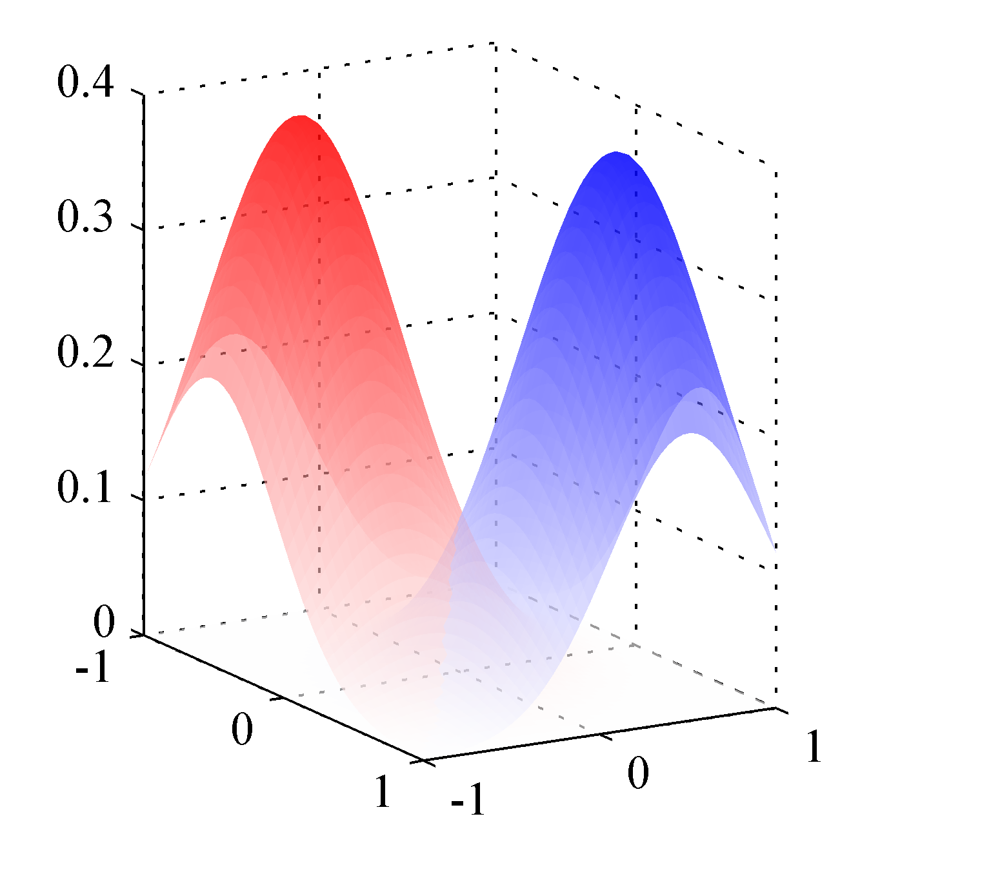
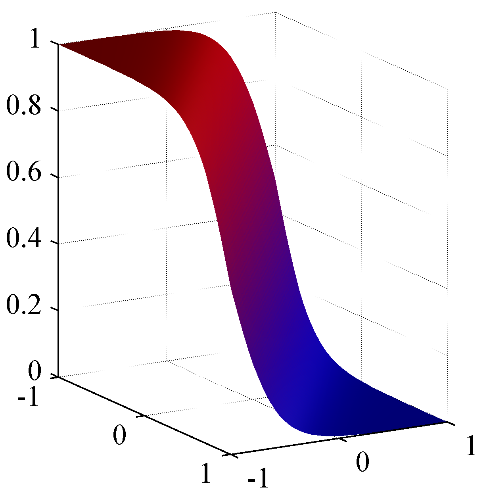

Logistic regression is used in machine learning extensively - every time we need to provide probabilistic semantics to an outcome e.g. predicting the risk of developing a given disease (e.g. diabetes; coronary heart disease), based on observed characteristics of the patient (age, sex, body mass index, results of various blood tests, etc.), whether an voter will vote for a given party, predicting the probability of failure of a given process, system or product, predicting a customer's propensity to purchase a product or halt a subscription, predicting the likelihood of a homeowner defaulting on a mortgage. Conditional random fields, an extension of logistic regression to sequential data, are used in Natural Language Processing (NLP). The common denominator in all above cases is that the outcome is an assignment to a distinct class.

## Binary case
If we consider the two class problem, we can write the posterior probability as

$$p(\mathcal{C}_1|\mathbf{x}) = \frac{p(\mathbf{x}|\mathcal{C}_1) p(\mathcal{C}_1)}{p(\mathbf{x}|\mathcal{C}_1) p(\mathcal{C}_1) + p(\mathbf{x}|\mathcal{C}_2) p(\mathcal{C}_2)} = \frac{1}{1 + exp(-\alpha)} = \sigma(\alpha)$$

where $\alpha = \ln \frac{p(\mathbf{x}|\mathcal{C}_1) p(\mathcal{C}_1)}{p(\mathbf{x}|\mathcal{C}_2) p(\mathcal{C}_2)}$

Assuming that the class-conditional densities $p(\mathbf{x}|\mathcal{C}_1)$ and $p(\mathbf{x}|\mathcal{C}_2)$ are Gaussian, the posterior distribution is given by

$$p(\mathcal{C}_1|\mathbf{x}) = \sigma(\mathbf{w}^T \mathbf{x} + w_0)$$

where the weights are the closed form solutions ($w_0$ is omitted),

$$\mathbf{w} = \Sigma^{-1}(\mu_1 - \mu_2)$$

The parameters $\mu$ and $\Sigma$ can be estimated using Maximum Likelihood. 

The figure below shows the corresponding posterior distribution $p(\mathcal{C}_1|\mathbf{x})$

*The class-conditional densities for two classes, denoted red and blue.*

*On the right is the corresponding posterior probability for the red class, which is given by a logistic sigmoid of a linear function of $x$.*